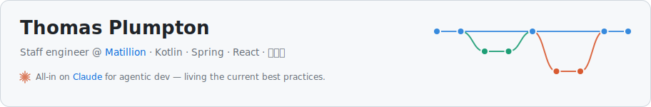
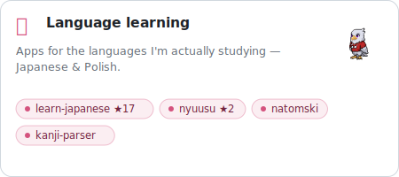
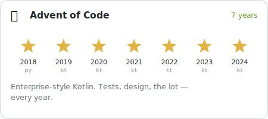
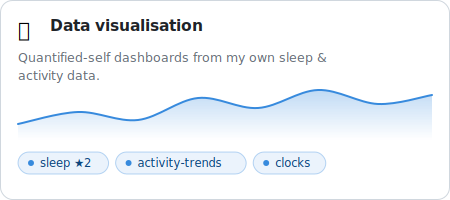
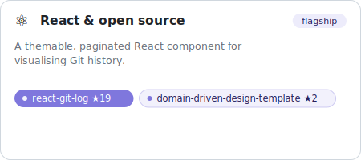
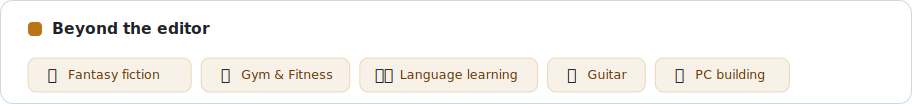
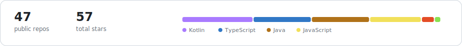

<!--
  This README is generated. Edit profile.config.json (content) or
  scripts/generate-cards.mjs (design), then run: node scripts/generate-cards.mjs
  A GitHub Action regenerates the cards on a schedule so the live stats stay fresh.
-->

<a href="https://github.com/TomPlum/react-git-log"><picture><source media="(prefers-color-scheme: dark)" srcset="assets/cards/hero-dark.svg" /></picture></a>

<a href="https://github.com/TomPlum/learn-japanese"><picture><source media="(prefers-color-scheme: dark)" srcset="assets/cards/language-dark.svg" /></picture></a> <a href="https://github.com/TomPlum?tab=repositories&q=advent-of-code"><picture><source media="(prefers-color-scheme: dark)" srcset="assets/cards/aoc-dark.svg" /></picture></a>

<a href="https://github.com/TomPlum/sleep"><picture><source media="(prefers-color-scheme: dark)" srcset="assets/cards/dataviz-dark.svg" /></picture></a> <a href="https://github.com/TomPlum/react-git-log"><picture><source media="(prefers-color-scheme: dark)" srcset="assets/cards/react-dark.svg" /></picture></a>

<picture><source media="(prefers-color-scheme: dark)" srcset="assets/cards/beyond-dark.svg" /></picture>

<picture><source media="(prefers-color-scheme: dark)" srcset="assets/cards/stats-dark.svg" /></picture>

<a href="https://tomplumpton.me">Portfolio</a> · <a href="https://github.com/TomPlum?tab=repositories">All repositories</a>

